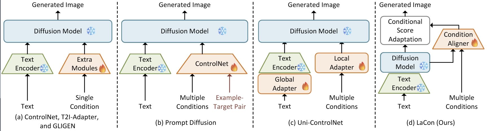

<div align="center">

# LaCon: Late-Constraint Diffusion for Steerable Guided Image Synthesis

Chang Liu, Rui Li, Kaidong Zhang, Xin Luo, Dong Liu

[[`Paper`]](https://arxiv.org/pdf/2305.11520) / [[`Project`]](https://alonzoleeeooo.github.io/LCDG/) / [[`Huggingface`]](https://huggingface.co/AlonzoLeeeooo/LaCon) / [[`ModelScope`]](https://modelscope.cn/models/AlonzoLeeeoooo/LaCon) / [`Demo`]
</div>

<!-- omit in toc -->
# Table of Contents
- [<u>1. News</u>](#news)
- [<u>2. To-Do Lists</u>](#to-do-lists)
- [<u>3. Overview of LaCon</u>](#overview-of-lacon)
- [<u>4. Code Structure</u>](#code-structure)
- [<u>5. Prerequisites</u>](#prerequisites)
- [<u>6. Training of Condition Aligner</u>](#training-of-condition-aligner)
- [<u>7. Sampling with Condition Aligner</u>](#sampling-with-condition-aligner)
- [<u>8. Evaluation</u>](#evaluation)
- [<u>9. Citation</u>](#citation)
- [<u>10. Stars, Forked, and Star History</u>](#stars-forked-and-star-history)

If you have any questions about this work, please feel free to [start a new issue](https://github.com/AlonzoLeeeooo/LCDG/issues/new) or [propose a PR](https://github.com/AlonzoLeeeooo/LCDG/pulls).

<!-- omit in toc -->
# News
- [Jun. 12th] We have updated the training and sampling code of LaCon. Pre-trained model weights are currently available at our [Huggingface repo](https://huggingface.co/AlonzoLeeeooo/LaCon/tree/main) and [ModelScope repo](https://modelscope.cn/models/AlonzoLeeeoooo/LaCon).

<!-- omit in toc -->
# To-Do Lists
  - [x] Upload a newer version of paper to arXiv
  - [x] Update the codebase
  - [x] Update the repo document
  - [x] Upload the pre-trained model weights of LaCon based on Celeb and Stable Diffusion v1.4
  - [ ] Update the pre-trained model weights of LaCon based on Stable Diffusion v2.1
  - [ ] Update implementation for local Gradio demo
  - [ ] Update online HuggingFace demo

<!-- omit in toc -->
# Overview of LaCon

> Diffusion models have demonstrated impressive abilities in generating photo-realistic and creative images. To offer more controllability for the generation process, existing studies, termed as early-constraint methods in this paper, leverage extra conditions and incorporate them into pre-trained diffusion models. Particularly, some of them adopt condition-specific modules to handle conditions separately, where they struggle to generalize across other conditions. Although follow-up studies present unified solutions to solve the generalization problem, they also require extra resources to implement, e.g., additional inputs or parameter optimization, where more flexible and efficient solutions are expected to perform steerable guided image synthesis. In this paper, we present an alternative paradigm, namely Late-Constraint Diffusion (LaCon), to simultaneously integrate various conditions into pre-trained diffusion models. Specifically, LaCon establishes an alignment between the external condition and the internal features of diffusion models, and utilizes the alignment to incorporate the target condition, guiding the sampling process to produce tailored results. Experimental results on COCO dataset illustrate the effectiveness and superior generalization capability of LaCon under various conditions and settings. Ablation studies investigate the functionalities of different components in LaCon, and illustrate its great potential to serve as an efficient solution to offer flexible controllability for diffusion models.

[<u><small><🎯Back to Table of Contents></small></u>](#table-of-contents)


<!-- omit in toc -->
# Code Structure
This GitHub repo is constructed following the code structure below:
```
LaCon/
└── condition_aligner_src                  <----- Source code of LaCon
    ├── __init__.py
    ├── condition_aligner_dataset.py       <----- Dataset
    ├── condition_aligner_model.py         <----- Model
    └── condition_aligner_runner.py        <----- Runner (train and inference)
├── configs                                <----- Configuration files
├── data-preprocessing                     <----- Code of data pre-processing
├── evaluation-metrics                     <----- Code of evaluation metrics
├── github-materials
├── ldm                                    <----- Source code of LDM (Stable Diffusion)
├── taming                                 <----- Source code of `taming` package
├── tools                                  <----- Code of toolkits to assist data pre-processing
├── README.md
├── condition-aligner-inference.py         <----- Script to reconstruct conditions with the condition aligner
├── condition-aligner-train.py             <----- Script to train condition aligner
├── generate-batch-image.py                <----- Script to generate results in batch
├── generate-single-image.py               <----- Script to generate a single result
└── install.sh                             <----- Bash script to install the virtual environment
```
[<u><small><🎯Back to Table of Contents></small></u>](#table-of-contents)

<!-- omit in toc -->
# Prerequisites
1. To install the virtual environment of LaCon, you can execute the following command lines:
```bash
conda create -n lacon
conda activate lacon
pip install torch==2.0.0 torchvision==0.15.1
bash install.sh
```

2. To prepare the pre-trained model weights of different components in `Stable Diffusion` as well as our condition aligner, please download the model weights from our [Huggingface repo](https://huggingface.co/AlonzoLeeeooo/LaCon) and put them in `./checkpoints`. Once the weights are downloaded, modify the configuration files in `./configs`. Check [this document](configs/README.md) for more details of modifying configuration files.
**We strongly recommend you to download [the whole Huggingface repo of CLIP](https://huggingface.co/openai/clip-vit-large-patch14) locally, in order to avoid the network issue of Huggingface.**

[<u><small><🎯Back to Table of Contents></small></u>](#table-of-contents)


<!-- omit in toc -->
# Training of Condition Aligner
1. We use a subset of the training set [COCO](https://cocodataset.org/) with approximate 10,000 data samples. To train the condition aligner, you need to follow the instructions in [this document](data-preprocessing/README.md) and construct the data in the following structure:
```bash
data/
└── bdcn-edges
    ├── 1.png
    ├── 2.png
    ├── ...
└── saliency-masks
    ├── 1.png
    ├── 2.png
    ├── ...
└── color-strokes
    ├── 1.png
    ├── 2.png
    ├── ...
└── coco-captions
    ├── 1.txt
    ├── 2.txt
    ├── ...
└── images
```


2. Once the training data is ready, you need to modify the configuration files following [this document](configs/README.md).
3. Now you are ready to go by executing the following command line:
```bash
python condition-aligner-train.py -b CONFIG_PATH -l OUTPUT_PATH
```
You can refer to this example command line:
```bash
python condition-aligner-train.py -b configs/sd-edge.yaml -l outputs/training/sd-edge
```

[<u><small><🎯Back to Table of Contents></small></u>](#table-of-contents)


<!-- omit in toc -->
# Sampling with Condition Aligner
Execute the following command line to generate an image with the trained condition aligner:
```bash
python generate-single-image.py --cond_type COND_TYPE --indir CONDITION_PATH --resume CONDITION_ALIGNER_PATH --caption TEXT_PROMPT --cond_scale CONTROLLING_SCALE --unconditional_guidance_scale CLASSIFIER_FREE_GUIDANCE_SCALE  --outdir OUTPUT_PATH -b CONFIG_PATH --seed SEED --truncation_steps TRUNCATION_STEPS --use_neg_prompt
```
You can refer to this example command line:
```bash
python generate-single-image.py --cond_type mask --indir examples/horse.png --resume checkpoints/sdv14_mask.pth --caption "a horse standing in the moon surface" --cond_scale 2.0 --unconditional_guidance_scale 6.0  --outdir outputs/ -b configs/sd-mask.yaml --seed 23 --truncation_steps 600 --use_neg_prompt
```
We suggest the following settings to achieve the optimal performance for various conditions:

|Condition|Setting|Model Weight|Controlling Scale|Truncation Steps|
|---|---|---|---|---|
|Canny Edge|Unconditional Generation|`sd_celeb_edge.pth`|2.0|500|
|HED Edge|Unconditional Generation|`sd_celeb_edge.pth`|2.0|500|
|User Sketch|Unconditional Generation|`sd_celeb_edge.pth`|2.0|600|
|Color Stroke|Unconditional Generation|`sd_celeb_color.pth`|2.0|600|
|Image Palette|Unconditional Generation|`sd_celeb_color.pth`|2.0|800|
|Canny Edge|T2I Generation|`sdv14_edge.pth`|2.0|500|
|HED Edge|T2I Generation|`sdv14_edge.pth`|2.5|500|
|User Sketch|T2I Generation|`sdv14_edge.pth`|2.0|600|
|Color Stroke|T2I Generation|`sdv14_color.pth`|2.0|600|
|Image Palette|T2I Generation|`sdv14_color.pth`|2.0|800|
|Saliency Mask|T2I Generation|`sdv14_mask.pth`|2.0|600|
|User Scribble|T2I Generation|`sdv14_mask.pth`|2.0|700|

[<u><small><🎯Back to Table of Contents></small></u>](#table-of-contents)


<!-- omit in toc -->
# Evaluation
Prepare the test set following the data structure below:
```bash
data/
└── bdcn-edges
    ├── 1.png
    ├── 2.png
    ├── ...
└── saliency-masks
    ├── 1.png
    ├── 2.png
    ├── ...
└── color-strokes
    ├── 1.png
    ├── 2.png
    ├── ...
└── image-palette
    ├── 1.png
    ├── 2.png
    ├── ...
└── coco-captions
    ├── 1.txt
    ├── 2.txt
    ├── ...
└── images
```

Execute the following command line to test all data samples in the test set:
```bash
python generate-batch-image.py -b CONFIG_PATH --indir DATA_FILELIST_PATH --text CAPTION_PATH --target_cond CONDITION_PATH --resume CONDITION_ALIGNER_PATH --cond_scale CONTROLLING_SCALE --truncation_steps TRUNCATION_STEPS
```
You can refer to this example command line:
```bash
python generate-batch-image.py -b configs/sd-mask.yaml --indir data/coco2017val/data_flist.txt --text data/coco2017val/coco-captions --target_cond data/coco2017val/saliency-masks --resume checkpoints/sdv14_mask.pth --cond_scale 2.0 --truncation_steps 600
```
To compute evaluation metrics (e.g., FID and CLIP scores), please refer to [this document](evaluation-metrics/README.md) for more details. We report the performance of LaCon on [COCO 2017 validation set](https://cocodataset.org/#download) in the following table:
|Condition|Model Weight|FID|CLIP Score|
|---|---|---|---|
|HED Edge|`sdv14_edge.pth`|21.02|0.2590|
|Color Stroke|`sdv14_color.pth`|20.27|0.2589|
|Image Palette|`sdv14_color.pth`|20.61|0.2580|
|Saliency Mask|`sdv14_mask.pth`|20.94|0.2617|

[<u><small><🎯Back to Table of Contents></small></u>](#table-of-contents)


<!-- omit in toc -->
# Citation
If you find our paper helpful to your work, please cite our paper with the following BibTeX reference:
```bibtex
@misc{liu-etal-2024-lacon,
      title={{LaCon: Late-Constraint Diffusion for Steerable Guided Image Synthesis}}, 
      author={{Chang Liu, Rui Li, Kaidong Zhang, Xin Luo, and Dong Liu}},
      year={2024},
      eprint={2305.11520},
      archivePrefix={arXiv},
      primaryClass={cs.CV}
}
```

[<u><small><🎯Back to Table of Contents></small></u>](#table-of-contents)


<!-- omit in toc -->
# Stars, Forked, and Star History
[](https://github.com/AlonzoLeeeooo/LCDG/stargazers)

[](https://github.com/AlonzoLeeeooo/LCDG/network/members)


<p align="center">
    <a href="https://api.star-history.com/svg?repos=AlonzoLeeeooo/LCDG&type=Date" target="_blank">
        
    </a>
<p>

[<u><small><🎯Back to Table of Contents></small></u>](#table-of-contents)
