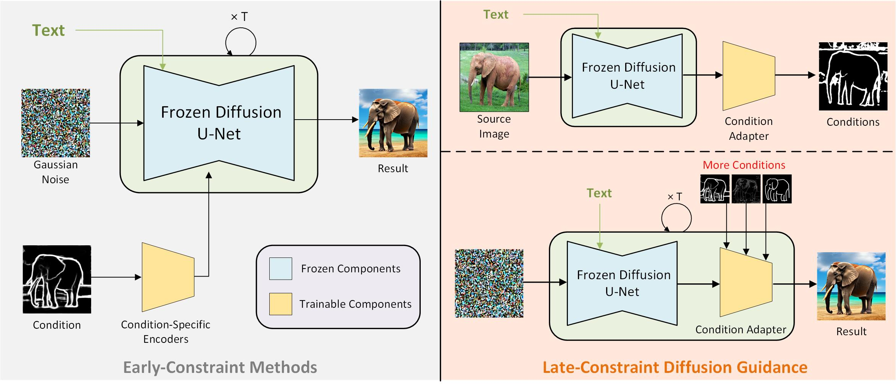
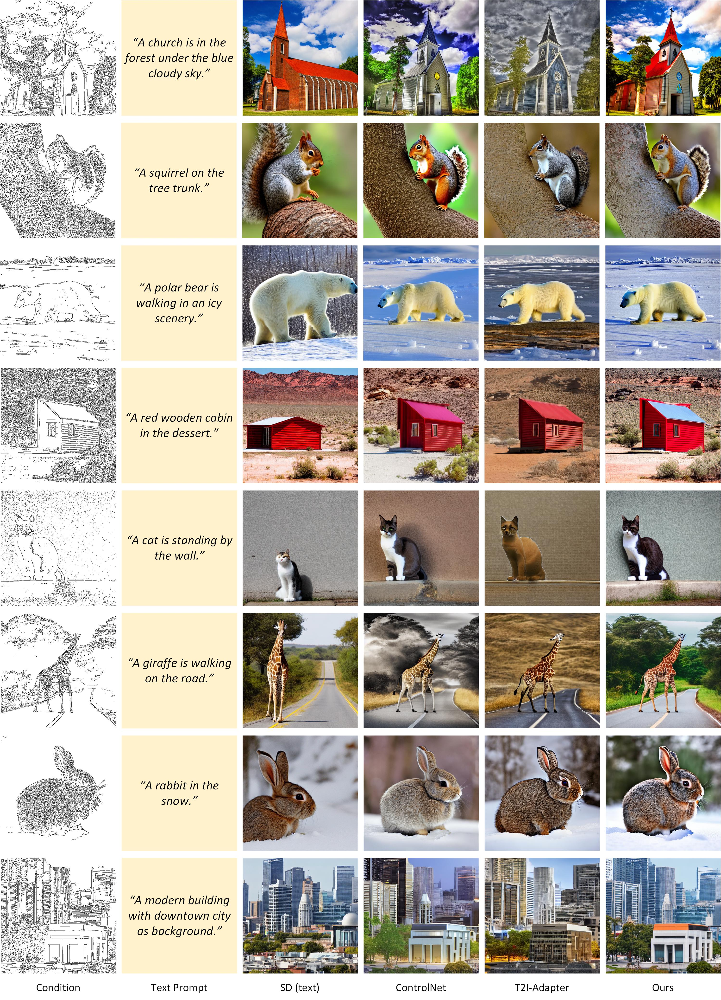
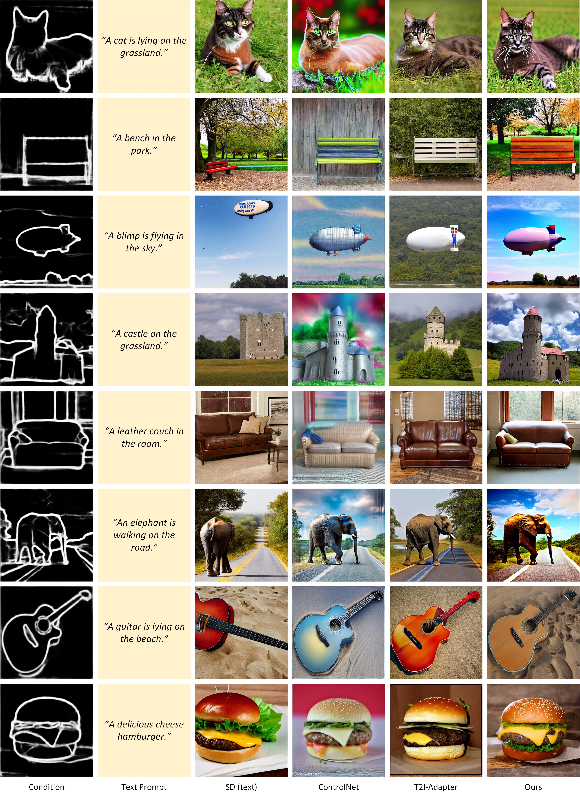
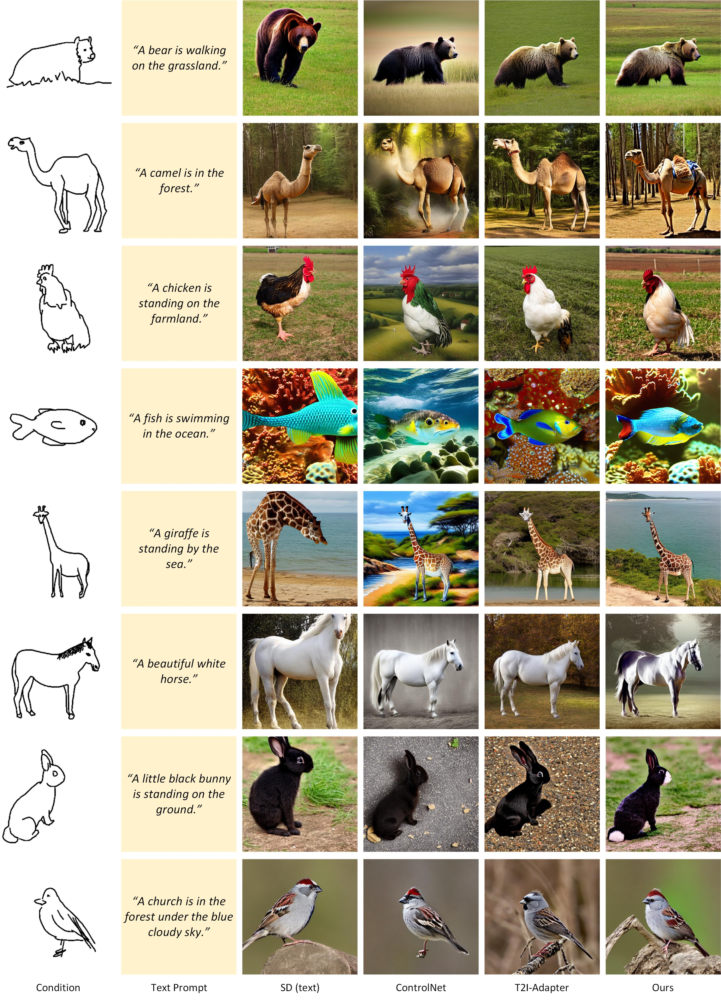
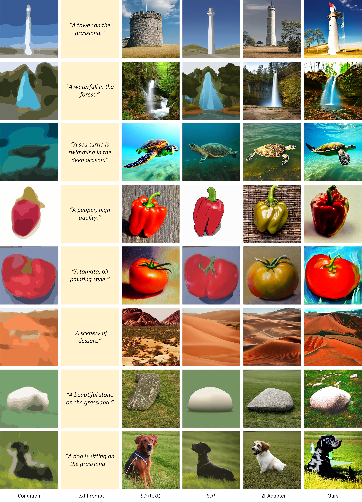
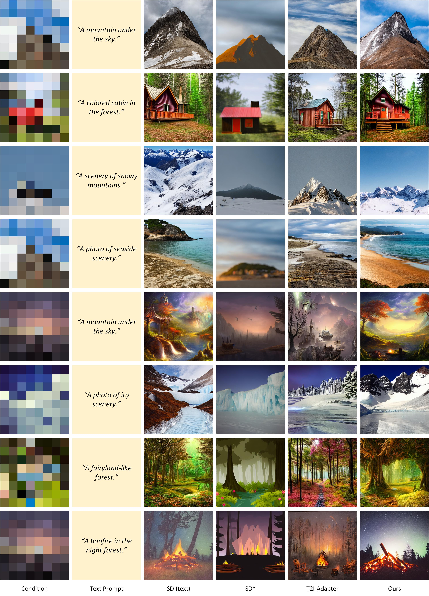
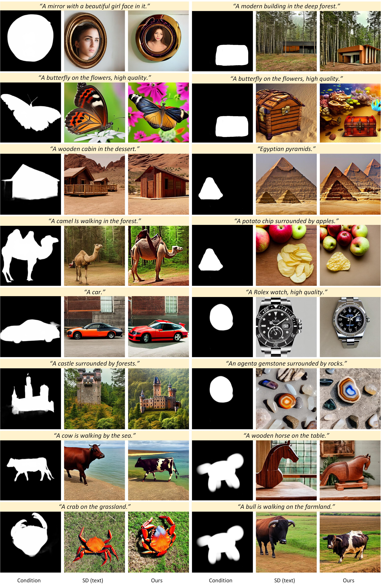

# Late-Constraint Diffusion Guidance for Controllable Image Synthesis
The official code implementation of "Late-Constraint Diffusion Guidance for Controllable Image Synthesis".

[[Paper]]([github_materials/tissor.jpg](https://arxiv.org/abs/2305.11520)) / [Project (coming soon)]

# Overview

Diffusion models, either with or without text condition, have demonstrated impressive capability in synthesizing photorealistic images given a few or even no words. These models may not fully satisfy user need, as normal users or artists intend to control the synthesized images with specific guidance, like overall layout, color, structure, object shape, and so on. To adapt diffusion models for controllable image synthesis, several methods have been proposed to incorporate the required conditions as regularization upon the intermediate features of the diffusion denoising network. These methods, known as early-constraint ones in this paper, have difficulties in handling multiple conditions with a single solution. They intend to train separate models for each specific condition, which require much training cost and result in non-generalizable solutions. To address these difficulties, we propose a new approach namely late-constraint: we leave the diffusion networks unchanged, but constrain its output to be aligned with the required conditions. Specifically, we train a lightweight condition adapter to establish the correlation between external conditions and internal representations of diffusion models. During the iterative denoising process, the conditional guidance is sent into corresponding condition adapter to manipulate the sampling process with the established correlation. We further equip the introduced late-constraint strategy with a timestep resampling method and an early stopping technique, which boost the quality of synthesized image meanwhile complying with the guidance. Our method outperforms the existing early-constraint methods and generalizes better to unseen condition.

# To-Do Lists
<div align="center">

</div>

- Currently we are working on cleaning up the codebase of LCDG. The code implementation of LCDG would be open-sourced ASAP. Afterwards we would provide more implementation of LCDG such as demonstration video, interactive demo on HuggingFace, and so on. Star the project to get notified!

# Prerequisites
To be implemented.

# Usage
To be implemented.

# Qualitative Comparison
## Canny Edge
<div align="center">

</div>

## HED Edge
<div align="center">

</div>

## User Sketch
<div align="center">

</div>

## Color Storke
<div align="center">

</div>

## Image Palette
<div align="center">

</div>

## Mask
<div align="center">

</div>

# License
This work is licensed under MIT license. See the [LICENSE](LICENSE) for details.

# Citation
If you find our work enlightening or the codebase is helpful to your work, please cite our paper:
```bibtex
@misc{liu2023lateconstraint,
    title={Late-Constraint Diffusion Guidance for Controllable Image Synthesis}, 
    author={Chang Liu and Dong Liu},
    year={2023},
    eprint={2305.11520},
    archivePrefix={arXiv},
    primaryClass={cs.CV}
}
```
